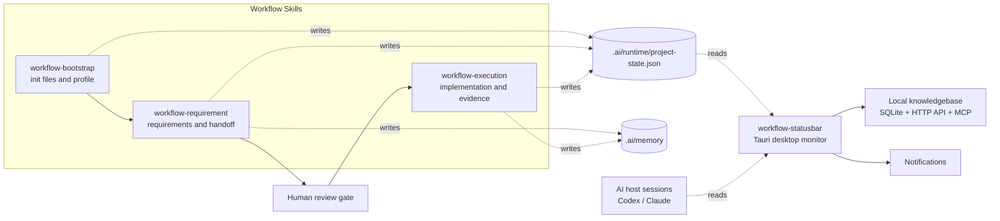

# Architecture

## 1. Project Scope

`workflow-skills` is a local workflow toolkit for repositories that use AI coding hosts. It provides three workflow skills plus an optional desktop monitor.

The project is intentionally file-based. It uses repository-local workflow documents, `.ai/memory`, and `.ai/runtime/project-state.json` instead of a remote project-management service.

## 2. Components

| 模块 | 定位 | 是否必选 | 主要产物 |
| --- | --- | --- | --- |
| `workflow-bootstrap` | 初始化仓库协作底座 | 必选 | `AGENTS.md`、`docs/workflow/`、`.ai/`、`context-brief.md`、`project-state.json`、`wf-*` 命令 |
| `workflow-requirement` | 把 PRD 治理成可交接任务 | 必选 | 需求池、任务看板、设计/追溯材料、任务记忆、状态回写 |
| `workflow-execution` | 在人工审核后执行开发收口 | 必选 | 代码改动、验证记录、证据、任务记忆、提交/闸门结论、状态与恢复摘要回写 |
| `workflow-statusbar` | 桌面状态聚合与提醒 | 可选 | 菜单栏/托盘面板、悬浮窗、通知、本地知识库 Web/API/MCP |

## 3. System Architecture



Core rules:

1. The skills are the action layer.
2. `project-state.json` is the runtime state source.
3. `.ai/memory/context-brief.md` is the short recovery source for Codex context compaction; it is overwritten with current focus, not used as an audit log.
4. `workflow-statusbar` is an observation layer.
5. Requirement review and execution start remain explicit human-controlled gates.

## 4. Technology Stack

### Workflow Skills

- 语言：`Python 3`
- 文档与状态格式：`Markdown`、`YAML`、`JSON`
- 命令入口：`workflow-bootstrap/scripts/workflow_cli.py`
- 短命令封装：`.ai/bin/workflow`、`wf-init`、`wf-doctor`、`wf-cons`、`wf-req`、`wf-exec`、`wf-arc`
- 主要数据源：`docs/workflow/`、`.ai/memory/`、`.ai/memory/context-brief.md`、`.ai/runtime/project-state.json`

### workflow-statusbar

- 桌面框架：`Tauri 2`
- 后端：`Rust 2021`
- 前端：`React 19`、`TypeScript 5`、`Vite 7`
- Tauri 插件：`notification`、`opener`、`single-instance`
- Rust 依赖：`serde`、`serde_json`、`dirs`、`rusqlite`、`chrono`、`ureq`、`tiny_http`、`sha2`
- 本地知识库：`SQLite` / `rusqlite` / `FTS5`
- MCP 入口：`Node.js` stdio 脚本 `workflow-statusbar/scripts/kb-mcp-server.mjs`

## 5. Runtime State Flow

```text
workflow skills
-> docs/workflow + .ai/memory
-> .ai/runtime/project-state.json
-> .ai/memory/context-brief.md
-> workflow-statusbar Rust backend
-> RuntimeState
-> Tauri get_runtime_state command + runtime-state event
-> React UI
```

`RuntimeState` currently contains legacy `codex` compatibility fields plus the multi-host fields:

- `hosts`
- `active_host`
- `other_host_summary`
- `projects`
- `groups`
- `summary`
- `spotlight_project`

## 6. Host Monitoring Sources

| Host | Sources | Notes |
| --- | --- | --- |
| Codex | `~/.codex/state_5.sqlite`, `~/.codex/logs_2.sqlite`, `pgrep -f "codex"` | Used for active thread, heartbeat, recent message, process state, and token usage where available. |
| Claude | `~/.claude/history.jsonl`, `~/.claude/projects/*/*.jsonl`, `pgrep -f "claude"` | Used for recent project sessions, heartbeat, last message, and process state. |
| Workflow project | `.ai/runtime/project-state.json` found from project paths | Used for workflow stage, gate, current requirement/task, risk, health, and blocked state. |
| Alert settings | Tauri config plus environment variables | Used for local notifications and optional remote forwarding. |

The primary host is selected by status priority, project-path match, recent activity, and a final stable tie-breaker.

## 7. Local Knowledgebase Flow

```text
workflow-statusbar 状态变化
-> 本地 SQLite knowledge.db
-> http://127.0.0.1:8788
-> /api/v1/* 只读 API
-> npm run kb:mcp
-> 外部 AI 客户端只读检索
```

V1 API / MCP 默认只读，写入类外部请求会被拒绝。正式写入仍应通过 Web UI、workflow skill 或后续人工确认链路完成。

## 8. Boundaries

- The skills do not provide a cloud backend.
- The statusbar does not approve requirements or start execution.
- The local API/MCP surface is for localhost usage.
- The statusbar depends on local Codex/Claude storage formats; adapters may need updates if those formats change.
- The current desktop experience is mostly tuned for macOS.

## 9. Documentation Sync Rules

当三 skill 或 statusbar 的职责、状态字段、接口、技术栈发生变化时，至少同步检查：

1. `README.md`
2. `ARCHITECTURE.md`
3. `workflow-statusbar/README.md`
4. `workflow-statusbar/docs/架构与功能说明.md`
5. `docs/workflow/PROJECT_CONTEXT.md`
6. `.ai/memory/tasks/index.md` 与对应任务记忆

如果变更涉及本地知识库 API/MCP，还需要同步：

1. `workflow-statusbar/docs/KNOWLEDGEBASE_MCP_API.md`
2. `workflow-statusbar/docs/WORKFLOW_PACK_SCHEMA.md`
3. 对应 `workflow-statusbar/docs/KNOWLEDGEBASE_*_REGRESSION.md`
