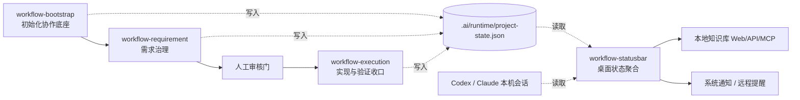

# 项目架构与技术说明

## 1. 项目定位

`workflow-skills` 是一套面向 AI 协作研发的治理型 skill 包。它不替代业务系统，也不是单纯的脚手架；核心目标是把仓库初始化、需求治理、执行验证、证据沉淀和运行状态放到同一套可追溯链路里。

项目由三个必选 workflow skill 和一个可选桌面观察层组成：

| 模块 | 定位 | 是否必选 | 主要产物 |
| --- | --- | --- | --- |
| `workflow-bootstrap` | 初始化仓库协作底座 | 必选 | `AGENTS.md`、`docs/workflow/`、`.ai/`、`project-state.json`、`wf-*` 命令 |
| `workflow-requirement` | 把 PRD 治理成可交接任务 | 必选 | 需求池、任务看板、设计/追溯材料、任务记忆、状态回写 |
| `workflow-execution` | 在人工审核后执行开发收口 | 必选 | 代码改动、验证记录、证据、任务记忆、提交/闸门结论、状态回写 |
| `workflow-statusbar` | 桌面状态聚合与提醒 | 可选 | 菜单栏/托盘面板、悬浮窗、通知、本地知识库 Web/API/MCP |

## 2. 总体架构



核心原则：

1. 三个 skill 是治理动作层，按 `bootstrap -> requirement -> execution` 顺序推进。
2. `.ai/runtime/project-state.json` 是跨阶段状态事实源，供脚本、AI 和 statusbar 共同读取。
3. `workflow-statusbar` 是观察层，不参与阶段门决策，不自动替代人工审核。
4. `.ai/memory/` 和 `docs/workflow/requirements/` 是长期证据与复用知识的主位置。

## 3. 技术栈

### 3.1 Workflow Skill 层

- 语言：`Python 3`
- 文档与状态格式：`Markdown`、`YAML`、`JSON`
- 命令入口：`workflow-bootstrap/scripts/workflow_cli.py`
- 短命令封装：`.ai/bin/workflow`、`wf-init`、`wf-doctor`、`wf-cons`、`wf-req`、`wf-exec`、`wf-arc`
- 主要数据源：`docs/workflow/`、`.ai/memory/`、`.ai/runtime/project-state.json`

### 3.2 workflow-statusbar 桌面层

- 桌面框架：`Tauri 2`
- 后端：`Rust 2021`
- 前端：`React 19`、`TypeScript 5`、`Vite 7`
- Tauri 插件：`notification`、`opener`、`single-instance`
- Rust 依赖：`serde`、`serde_json`、`dirs`、`rusqlite`、`chrono`、`ureq`、`tiny_http`、`sha2`
- 本地知识库：`SQLite` / `rusqlite` / `FTS5`
- MCP 入口：`Node.js` stdio 脚本 `workflow-statusbar/scripts/kb-mcp-server.mjs`

## 4. 核心目录

```text
workflow-bootstrap/
workflow-requirement/
workflow-execution/
workflow-statusbar/
docs/workflow/
.ai/
```

关键文件：

- `README.md`：项目总入口。
- `ARCHITECTURE.md`：本文档，说明架构、技术栈和模块关系。
- `workflow-statusbar/README.md`：statusbar 使用与打包说明。
- `workflow-statusbar/docs/架构与功能说明.md`：statusbar 详细实现说明。
- `docs/workflow/PROJECT_CONTEXT.md`：当前工作区共享事实。
- `docs/workflow/开发协作约定.md`：当前工作区协作约束。

## 5. 运行与接口链路

### 5.1 Skill 命令链路

```text
wf-init / wf-req / wf-exec
-> .ai/bin/workflow
-> workflow-bootstrap/scripts/workflow_cli.py
-> workflow-bootstrap / workflow-requirement / workflow-execution 对应脚本
-> docs/workflow + .ai/memory + .ai/runtime/project-state.json
```

### 5.2 Statusbar 状态链路

```text
~/.codex/state_5.sqlite + ~/.codex/logs_2.sqlite
+ 项目 .ai/runtime/project-state.json
-> Rust 轮询聚合
-> RuntimeState
-> Tauri command get_runtime_state
-> Tauri event runtime-state
-> React 面板 / 悬浮窗 / 通知
```

### 5.3 本地知识库链路

```text
workflow-statusbar 状态变化
-> 本地 SQLite knowledge.db
-> http://127.0.0.1:8788
-> /api/v1/* 只读 API
-> npm run kb:mcp
-> 外部 AI 客户端只读检索
```

V1 API / MCP 默认只读，写入类外部请求会被拒绝。正式写入仍应通过 Web UI、workflow skill 或后续人工确认链路完成。

## 6. workflow-statusbar 是什么

`workflow-statusbar` 是这套 workflow 的桌面观察层。它适合常驻运行，用来回答三个问题：

1. 当前 AI Host 还在跑、在等输入、卡住，还是已经空闲？
2. 当前接入 workflow 的项目处在什么阶段、哪个任务、风险如何？
3. 关键事件是否需要提醒，是否要沉淀进本地知识库？

它主要做：

- 自动发现最近活跃的 workflow 项目。
- 读取 `.ai/runtime/project-state.json` 和本机 AI Host 会话。
- 展示项目阶段、任务状态、阻塞、Token 和健康摘要。
- 在执行中、阻塞、完成、离线等状态变化时触发通知。
- 提供本地知识库 Web 页面、只读 V1 API 和 stdio MCP server。

它不做：

- 不替代 `workflow-requirement` 的人工审核门。
- 不直接启动 `workflow-execution`。
- 不替代 Git 提交、发布闸门或测试验收。
- 不作为公网服务暴露，默认只面向本机使用。

## 7. 更新文档时的同步规则

当三 skill 或 statusbar 的职责、状态字段、接口、技术栈发生变化时，至少同步检查：

1. `README.md`
2. `ARCHITECTURE.md`
3. `workflow-statusbar/README.md`
4. `workflow-statusbar/docs/架构与功能说明.md`
5. `docs/workflow/PROJECT_CONTEXT.md`
6. `.ai/memory/tasks/index.md` 与对应任务记忆

如果变更涉及本地知识库 API/MCP，还需要同步：

1. `workflow-statusbar/docs/KNOWLEDGEBASE_MCP_API.md`
2. `workflow-statusbar/docs/WORKFLOW_PACK_SCHEMA.md`
3. 对应 `workflow-statusbar/docs/KNOWLEDGEBASE_*_REGRESSION.md`
