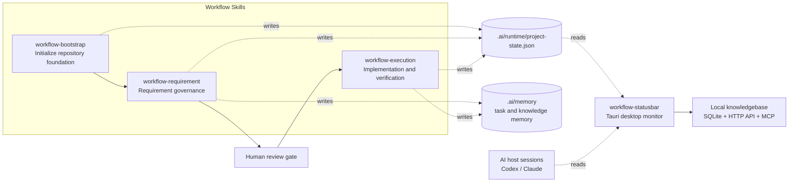

<div align="center">

# Workflow Skills + Statusbar

**Repository workflow skills for AI-assisted engineering, plus an optional local desktop status monitor.**

[](https://github.com/beyond-snail/workflow-skills/stargazers)
[](https://github.com/beyond-snail/workflow-skills/releases)
[](LICENSE)
[](CONTRIBUTING.md)
[](SECURITY.md)

[Architecture](ARCHITECTURE.md) · [Statusbar](workflow-statusbar/README.md) · [Workflow Bootstrap](workflow-bootstrap/SKILL.md) · [Workflow Requirement](workflow-requirement/SKILL.md) · [Workflow Execution](workflow-execution/SKILL.md)

</div>

---

## What This Project Is

`workflow-skills` is a set of local AI workflow skills for repositories that use Codex, Claude, or similar AI coding hosts. It keeps project context, requirements, task boards, execution evidence, and runtime state in predictable files so a human and multiple AI sessions can resume work without rediscovering the project from scratch.

The repository contains four main parts:

| Component | Type | Purpose |
| --- | --- | --- |
| `workflow-bootstrap` | Skill | Initializes the repository workflow foundation: `AGENTS.md`, `docs/workflow/`, `.ai/`, runtime profile, state file, and `wf-*` commands. |
| `workflow-requirement` | Skill | Turns PRD or requirement input into a requirement pool, task board, handoff documents, and task memory. It stops at the human review gate. |
| `workflow-execution` | Skill | Runs after human approval and explicit start. It guides implementation, verification, evidence recording, memory updates, and optional commit/release gates. |
| `workflow-statusbar` | Desktop app | Optional Tauri app that monitors local AI host sessions and workflow project state, then shows status, alerts, and local knowledgebase access. |

This project is not a SaaS service and does not require a remote database. The workflow files live in the target repository; the desktop app reads local files and localhost services.

## Architecture



Key facts:

- The three workflow skills are the action layer. They create or update files in the repository.
- `.ai/runtime/project-state.json` is the shared runtime state source for workflow progress.
- `.ai/memory/` stores reusable task memory and project knowledge.
- `workflow-statusbar` is an observation layer. It does not approve requirements, start execution, or replace tests.
- The detailed architecture is documented in [ARCHITECTURE.md](ARCHITECTURE.md).

## workflow-statusbar

`workflow-statusbar` is a local desktop monitor built with `Tauri 2 + Rust + React + TypeScript + Vite`. It is optional, but useful when you run AI-assisted work across multiple local repositories.

It currently monitors these sources:

| Source | Files / Signals | Used For |
| --- | --- | --- |
| Codex | `~/.codex/state_5.sqlite`, `~/.codex/logs_2.sqlite`, `pgrep -f "codex"` | Active thread, heartbeat, recent message, process state, token usage where available. |
| Claude | `~/.claude/history.jsonl`, `~/.claude/projects/*/*.jsonl`, `pgrep -f "claude"` | Recent project sessions, heartbeat, last message, process state. |
| Workflow project | `.ai/runtime/project-state.json` discovered from project paths | Stage, gate, current requirement/task, risk, health, blocked state. |
| Alert settings | Tauri app config and environment variables | Local notifications and optional remote alert forwarding. |

The UI chooses a primary host session from all detected host sessions using status priority, recent activity, and project-path match. It can still expose legacy `codex` fields in `RuntimeState` for compatibility, but the current model is multi-host: `hosts`, `active_host`, and `other_host_summary`.

Statusbar docs:

- [workflow-statusbar/README.md](workflow-statusbar/README.md)
- [workflow-statusbar/docs/架构与功能说明.md](workflow-statusbar/docs/架构与功能说明.md)
- [workflow-statusbar/docs/STATUS_MODEL.md](workflow-statusbar/docs/STATUS_MODEL.md)

## Local Knowledgebase, API, and MCP

The desktop app also includes a local knowledgebase service:

- Local Web/API default: `http://127.0.0.1:8788`
- Storage: local SQLite database
- V1 HTTP API: read-only endpoints for search, templates, task context, evidence, health, and workflow packs
- MCP server: `npm run kb:mcp`, implemented as a Node.js stdio server

The V1 API and MCP tools are designed for localhost use. Write-like external requests are rejected; formal writes should go through workflow skills, the Web UI, or a future confirmation flow.

See [workflow-statusbar/docs/KNOWLEDGEBASE_MCP_API.md](workflow-statusbar/docs/KNOWLEDGEBASE_MCP_API.md).

## Repository Layout

```text
workflow-bootstrap/
  SKILL.md
  scripts/
  references/

workflow-requirement/
  SKILL.md
  scripts/
  references/
  assets/
  templates/

workflow-execution/
  SKILL.md
  scripts/
  references/
  assets/

workflow-statusbar/
  src/                  React UI
  src-tauri/            Rust/Tauri backend
  docs/                 Status model, API/MCP, regression notes
  scripts/              MCP server and packaging helpers
  fixtures/             Sample runtime state

ARCHITECTURE.md
CONTRIBUTING.md
SECURITY.md
LICENSE
```

## Generated Files in a Target Repository

After `workflow-bootstrap` initializes another repository, that target repository normally gets files like:

```text
AGENTS.md
docs/workflow/PROJECT_CONTEXT.md
docs/workflow/开发协作约定.md
docs/workflow/requirements/需求池.md
docs/workflow/requirements/任务看板.md
.ai/memory/tasks/index.md
.ai/memory/knowledge/README.md
.ai/runtime/profile/project-profile.yml
.ai/runtime/project-state.json
.ai/bin/workflow
.ai/bin/wf-init
.ai/bin/wf-doctor
.ai/bin/wf-cons
.ai/bin/wf-req
.ai/bin/wf-exec
.ai/bin/wf-arc
```

## Quick Start

### 1. Install the Three Skills

From this repository root:

```bash
for d in workflow-bootstrap workflow-requirement workflow-execution; do
  rsync -a ./$d/ ~/.codex/skills/$d/
done

for d in workflow-bootstrap workflow-requirement workflow-execution; do
  rsync -a ./$d/ ~/.claude/skills/$d/
done
```

### 2. Initialize a Target Repository

Run inside the target repository:

```bash
python3 ~/.codex/skills/workflow-bootstrap/scripts/workflow_cli.py init \
  --workspace-root . \
  --host codex --host claude
```

Dry run:

```bash
python3 ~/.codex/skills/workflow-bootstrap/scripts/workflow_cli.py init \
  --workspace-root . \
  --host codex --host claude \
  --dry-run
```

### 3. Run Requirement Governance

```bash
python3 ~/.codex/skills/workflow-bootstrap/scripts/workflow_cli.py req \
  --workspace-root . \
  --theme "Your requirement theme" \
  --summary "One-line summary"
```

This stage should stop at a human review gate.

### 4. Run Execution After Approval

```bash
python3 ~/.codex/skills/workflow-bootstrap/scripts/workflow_cli.py exec \
  --workspace-root . \
  --req-id REQ-xxxx \
  --task-id TASK-xxxx \
  --summary "Implementation and verification summary"
```

Short commands such as `wf-init`, `wf-req`, and `wf-exec` are generated into the target repository under `.ai/bin/`.

## Statusbar Development

```bash
cd workflow-statusbar
source "$HOME/.cargo/env"
npm install
npm run tauri dev
```

Build checks:

```bash
cd workflow-statusbar
npm run build

cd src-tauri
cargo check
```

Packaging:

```bash
cd workflow-statusbar
npm run package:current
```

## Workflow Rules

The intended order is:

```text
bootstrap -> requirement -> human review -> execution -> verification -> memory/evidence
```

Important boundaries:

- `workflow-bootstrap` does not implement business logic.
- `workflow-requirement` does not write code.
- `workflow-execution` requires human approval and an explicit start signal.
- `workflow-statusbar` only observes and alerts. It does not decide stage gates.

## Verification Used in This Repository

Typical checks for this repository:

```bash
cd workflow-statusbar
npm run build

cd src-tauri
cargo check
```

For API/MCP changes, use the smoke examples in:

- [workflow-statusbar/docs/KNOWLEDGEBASE_MCP_API.md](workflow-statusbar/docs/KNOWLEDGEBASE_MCP_API.md)
- [workflow-statusbar/docs/KNOWLEDGEBASE_V5_REGRESSION.md](workflow-statusbar/docs/KNOWLEDGEBASE_V5_REGRESSION.md)
- [workflow-statusbar/docs/KNOWLEDGEBASE_V6_REGRESSION.md](workflow-statusbar/docs/KNOWLEDGEBASE_V6_REGRESSION.md)
- [workflow-statusbar/docs/KNOWLEDGEBASE_V7_REGRESSION.md](workflow-statusbar/docs/KNOWLEDGEBASE_V7_REGRESSION.md)

## Current Boundaries

- The desktop experience is currently most tuned for macOS, although Tauri supports cross-platform builds.
- The statusbar reads local AI host files; if Codex or Claude change their local storage format, adapters may need updates.
- The local API/MCP surface is intended for localhost access, not public network exposure.
- Some generated workflow documents live in target repositories, not in this source repository.

## License

MIT. See [LICENSE](LICENSE).
