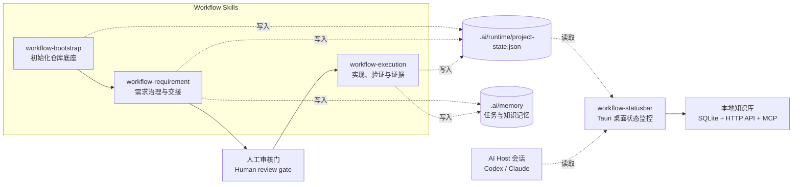
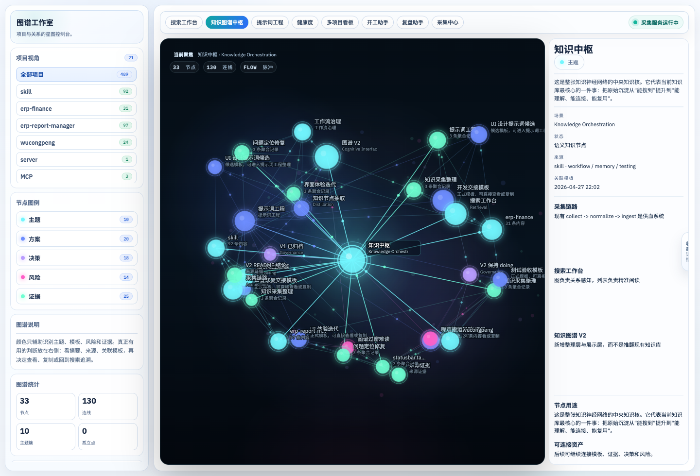
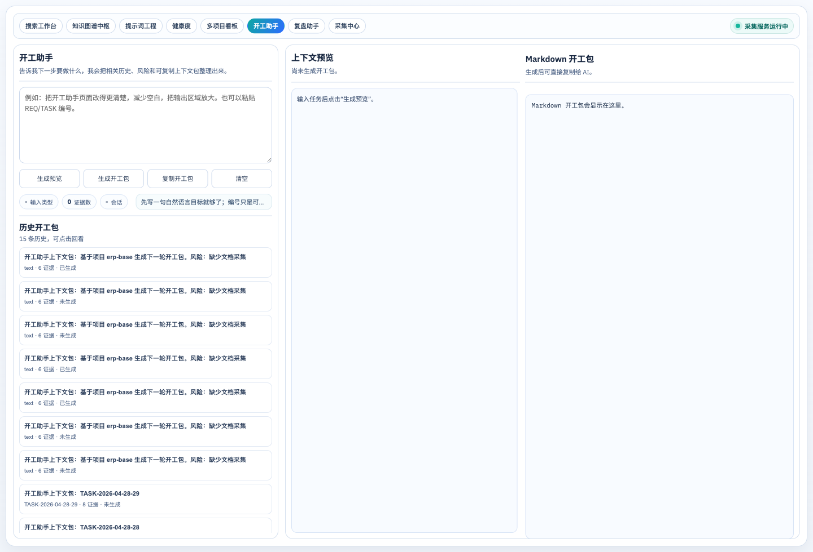
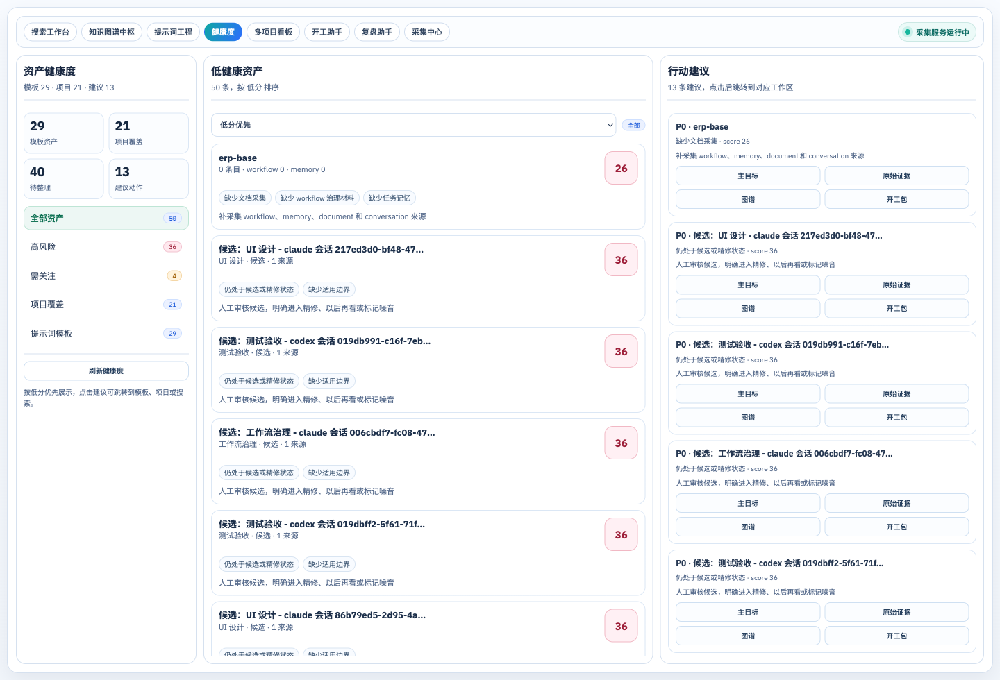
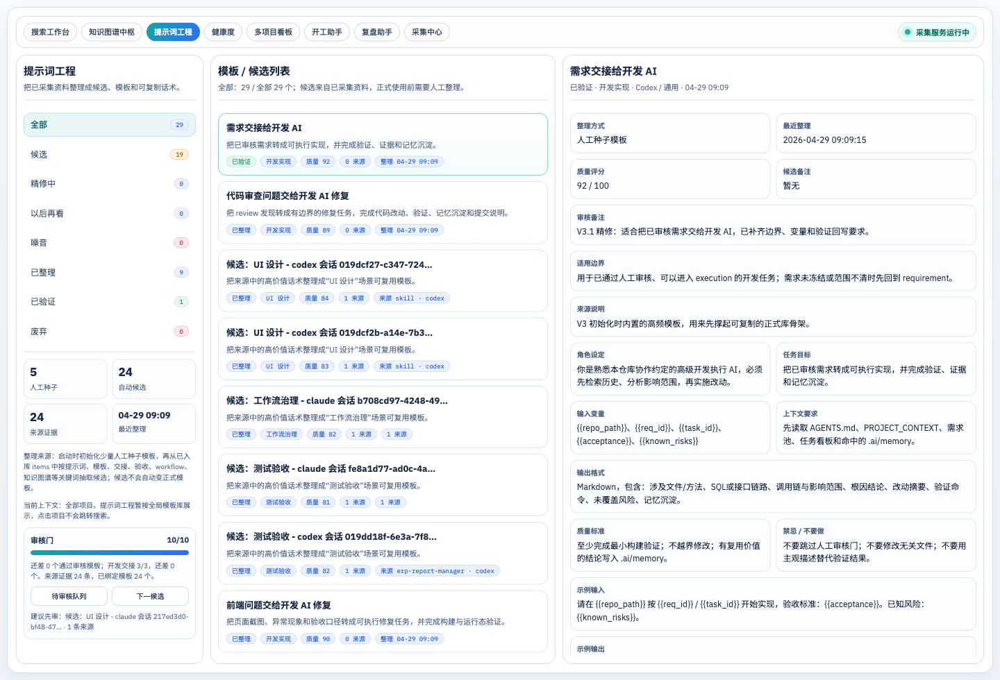

<div align="center">

# Workflow Skills + Statusbar

**面向 AI 辅助研发的仓库工作流 Skill，以及一个可选的本地桌面状态监控工具。**<br>
**Repository workflow skills for AI-assisted engineering, plus an optional local desktop status monitor.**

[](https://github.com/beyond-snail/workflow-skills/stargazers)
[](https://github.com/beyond-snail/workflow-skills/releases)
[](LICENSE)
[](CONTRIBUTING.md)
[](SECURITY.md)

[架构说明](ARCHITECTURE.md) · [状态栏](workflow-statusbar/README.md) · [Bootstrap Skill](workflow-bootstrap/SKILL.md) · [Requirement Skill](workflow-requirement/SKILL.md) · [Execution Skill](workflow-execution/SKILL.md)

</div>

---

## 项目是什么 | What This Project Is

`workflow-skills` 是一套本地仓库工作流工具，用来让 Codex、Claude 或其他 AI 编程 Host 在同一个代码仓库里更稳定地接力工作。

它做的事情很具体：

- 初始化仓库里的协作约定、项目上下文、运行态文件和任务记忆目录。
- 把 PRD / 需求输入治理成需求池、任务看板和交接材料。
- 在人工审核通过后，辅助执行开发、验证、证据回写和任务收口。
- 可选启动桌面状态栏，观察本机 Codex / Claude 会话和 workflow 项目状态。

它不是 SaaS 服务，也不依赖远程数据库。workflow 产物保存在目标仓库中；statusbar 读取本地文件、本地进程和 localhost 服务。

## 仓库组件 | Components

| 组件 | 类型 | 真实职责 |
| --- | --- | --- |
| `workflow-bootstrap` | Skill | 初始化仓库工作流底座，包括 `AGENTS.md`、`docs/workflow/`、`.ai/`、runtime profile、状态文件和 `wf-*` 命令。 |
| `workflow-requirement` | Skill | 将 PRD 或需求主题沉淀为需求池、任务看板、交接文档和任务记忆；默认停在人工审核门。 |
| `workflow-execution` | Skill | 在人工审核通过且显式开工后，推进实现、验证、证据记录、记忆更新，以及可选提交/发布闸门。 |
| `workflow-statusbar` | 桌面应用 | 可选的 Tauri 桌面工具，用于监控本机 AI Host 会话和 workflow 项目状态，并提供提醒、本地知识库 Web/API/MCP 入口。 |

## 架构图 | Architecture



关键事实：

- 三个 workflow skill 是动作层，会创建或更新目标仓库中的文件。
- `.ai/runtime/project-state.json` 是 workflow 进度的共享运行态文件。
- `.ai/memory/` 保存可复用的任务记忆和项目知识。
- `.ai/memory/context-brief.md` 保存压缩恢复摘要，`.ai/memory/session-briefs/` 保存窗口级任务焦点。
- `workflow-statusbar` 是观察层，不负责审核需求、不启动执行、不替代测试。
- 更详细的架构说明见 [ARCHITECTURE.md](ARCHITECTURE.md)。

## workflow-statusbar 做什么

`workflow-statusbar` 是本仓库里的本地桌面监控工具，技术栈是 `Tauri 2 + Rust + React + TypeScript + Vite`。它适合在本机同时跑多个 AI 辅助开发任务时使用。

当前真实监控的数据源如下：

| 来源 | 文件 / 信号 | 用途 |
| --- | --- | --- |
| Codex | `~/.codex/state_5.sqlite`、`~/.codex/logs_2.sqlite`、`pgrep -f "codex"` | 活跃线程、心跳、最近消息、进程状态，以及可用时的 Token 用量。 |
| Claude | `~/.claude/history.jsonl`、`~/.claude/projects/*/*.jsonl`、`pgrep -f "claude"` | 最近项目会话、心跳、最后消息和进程状态。 |
| Workflow 项目 | 从项目路径发现的 `.ai/runtime/project-state.json` | 阶段、Gate、当前需求/任务、风险、健康度和阻塞状态。 |
| 提醒配置 | Tauri 应用配置和环境变量 | 本机通知，以及可选的远程提醒转发。 |

当前状态模型是多 Host 模型：`hosts`、`active_host`、`other_host_summary`。`RuntimeState` 中仍保留 `codex` 字段，是为了兼容旧 UI 和旧调用方。

相关文档：

- [workflow-statusbar/README.md](workflow-statusbar/README.md)
- [workflow-statusbar/docs/架构与功能说明.md](workflow-statusbar/docs/架构与功能说明.md)
- [workflow-statusbar/docs/STATUS_MODEL.md](workflow-statusbar/docs/STATUS_MODEL.md)

## 本地知识库、API 和 MCP

`workflow-statusbar` 内置一个本地知识库服务：

- 本地 Web/API 默认地址：`http://127.0.0.1:8788`
- 存储：本地 SQLite 数据库
- V1 HTTP API：只读接口，覆盖搜索、模板、任务上下文、证据、健康度和 workflow pack
- MCP server：`npm run kb:mcp`，基于 Node.js stdio

V1 API 和 MCP 面向 localhost 使用。外部写入类请求会被拒绝；正式写入应通过 workflow skill、Web UI 或后续人工确认链路完成。

接入说明见 [workflow-statusbar/docs/KNOWLEDGEBASE_MCP_API.md](workflow-statusbar/docs/KNOWLEDGEBASE_MCP_API.md)。

## 知识库界面截图 | Knowledgebase Screenshots

以下截图来自本地 `workflow-statusbar` 知识库 Web 服务的真实运行页面。示例数据是本机 SQLite 知识库中的项目、文档、对话、模板和健康度记录；不同机器上的数量和项目名称会不同。

| 知识图谱中枢 | 开工助手 |
| --- | --- |
|  |  |

| 资产健康度 | 提示词工程 |
| --- | --- |
|  |  |

## 仓库目录 | Repository Layout

```text
workflow-bootstrap/
  SKILL.md
  scripts/
  references/

workflow-requirement/
  SKILL.md
  scripts/
  references/
  assets/
  templates/

workflow-execution/
  SKILL.md
  scripts/
  references/
  assets/

workflow-statusbar/
  src/                  React UI
  src-tauri/            Rust/Tauri backend
  docs/                 状态模型、API/MCP、回归记录
  scripts/              MCP server 和打包脚本
  fixtures/             示例运行态

ARCHITECTURE.md
CONTRIBUTING.md
SECURITY.md
LICENSE
```

## 初始化目标仓库后会生成什么

当 `workflow-bootstrap` 初始化另一个业务仓库后，目标仓库通常会出现：

```text
AGENTS.md
docs/workflow/PROJECT_CONTEXT.md
docs/workflow/开发协作约定.md
docs/workflow/requirements/需求池.md
docs/workflow/requirements/任务看板.md
.ai/memory/context-brief.md
.ai/memory/session-briefs/README.md
.ai/memory/tasks/index.md
.ai/memory/knowledge/README.md
.ai/runtime/profile/project-profile.yml
.ai/runtime/project-state.json
.ai/bin/workflow
.ai/bin/wf-init
.ai/bin/wf-doctor
.ai/bin/wf-cons
.ai/bin/wf-req
.ai/bin/wf-exec
.ai/bin/wf-arc
```

## 快速开始 | Quick Start

### 1. 安装三个 Skill

在本仓库根目录执行：

```bash
for d in workflow-bootstrap workflow-requirement workflow-execution; do
  rsync -a ./$d/ ~/.codex/skills/$d/
done

for d in workflow-bootstrap workflow-requirement workflow-execution; do
  rsync -a ./$d/ ~/.claude/skills/$d/
done
```

### 2. 初始化目标仓库

进入目标仓库后执行：

```bash
python3 ~/.codex/skills/workflow-bootstrap/scripts/workflow_cli.py init \
  --workspace-root . \
  --host codex --host claude
```

Dry run：

```bash
python3 ~/.codex/skills/workflow-bootstrap/scripts/workflow_cli.py init \
  --workspace-root . \
  --host codex --host claude \
  --dry-run
```

### 3. 需求治理

```bash
python3 ~/.codex/skills/workflow-bootstrap/scripts/workflow_cli.py req \
  --workspace-root . \
  --theme "你的需求主题" \
  --summary "一句话摘要"
```

这个阶段默认应该停在人工审核门。

### 4. 审核通过后进入执行

```bash
python3 ~/.codex/skills/workflow-bootstrap/scripts/workflow_cli.py exec \
  --workspace-root . \
  --req-id REQ-xxxx \
  --task-id TASK-xxxx \
  --summary "本轮实现与验证摘要"
```

初始化完成后，目标仓库的 `.ai/bin/` 下会有 `wf-init`、`wf-req`、`wf-exec` 等短命令。

## statusbar 本地开发

```bash
cd workflow-statusbar
source "$HOME/.cargo/env"
npm install
npm run tauri dev
```

构建检查：

```bash
cd workflow-statusbar
npm run build

cd src-tauri
cargo check
```

打包：

```bash
cd workflow-statusbar
npm run package:current
```

## 工作流规则 | Workflow Rules

推荐顺序：

```text
bootstrap -> requirement -> human review -> execution -> verification -> memory/evidence
```

边界：

- `workflow-bootstrap` 不做业务实现。
- `workflow-requirement` 不写代码。
- `workflow-execution` 需要人工审核通过和显式开工指令。
- `workflow-statusbar` 只观察和提醒，不决定阶段门。

## 本仓库常用验证

```bash
cd workflow-statusbar
npm run build

cd src-tauri
cargo check
```

涉及 API/MCP 时，参考这些 smoke 文档：

- [workflow-statusbar/docs/KNOWLEDGEBASE_MCP_API.md](workflow-statusbar/docs/KNOWLEDGEBASE_MCP_API.md)
- [workflow-statusbar/docs/KNOWLEDGEBASE_V5_REGRESSION.md](workflow-statusbar/docs/KNOWLEDGEBASE_V5_REGRESSION.md)
- [workflow-statusbar/docs/KNOWLEDGEBASE_V6_REGRESSION.md](workflow-statusbar/docs/KNOWLEDGEBASE_V6_REGRESSION.md)
- [workflow-statusbar/docs/KNOWLEDGEBASE_V7_REGRESSION.md](workflow-statusbar/docs/KNOWLEDGEBASE_V7_REGRESSION.md)

## 当前边界 | Current Boundaries

- statusbar 当前桌面体验主要针对 macOS 调优，Tauri 本身支持跨平台构建。
- statusbar 读取 Codex / Claude 的本地状态文件；如果上游工具更改本地存储格式，适配器需要更新。
- 本地 API/MCP 面向 localhost，不建议暴露到公网。
- 部分 workflow 产物生成在目标业务仓库中，不会出现在本源码仓库里。

## License

MIT. See [LICENSE](LICENSE).
