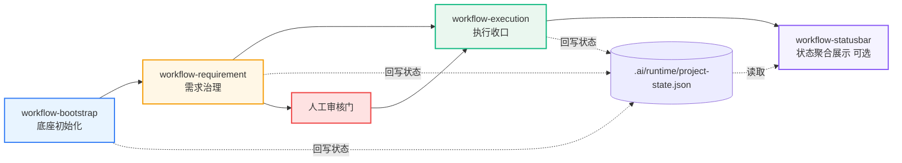

<div align="center">

# Workflow Skills + Statusbar

**AI 协作研发治理链路：`bootstrap -> requirement -> execution`**  
**Unified workflow skills for AI-assisted engineering with optional status monitoring.**

[](https://github.com/beyond-snail/workflow-skills/stargazers)
[](https://github.com/beyond-snail/workflow-skills/releases)
[](LICENSE)
[](CONTRIBUTING.md)
[](SECURITY.md)

[快速开始](#快速开始--quick-start) • [架构与技术说明](ARCHITECTURE.md) • [架构草图](docs/可视化草图.md) • [状态看板](workflow-statusbar/README.md) • [开源与贡献](#14-开源与贡献)

</div>

---

## 项目简介 | Overview

很多团队在引入 AI 之后会遇到一个反直觉问题：代码产出更快了，但项目不一定更顺，甚至更乱。

常见症状：

- AI 每次进仓库都像第一次来，不知道上下文和阶段
- 需求、任务、代码、测试记录分散，团队没有共同事实源
- 需求还没治理清楚就开始实现，返工变快
- 代码改完缺证据，下一轮无法顺畅接力

`workflow-skills` 不是“再加一个工具”，而是把上面的问题拆成三个阶段治理：

- `workflow-bootstrap`：初始化协作底座与统一入口
- `workflow-requirement`：需求入池、任务拆解、交接收口
- `workflow-execution`：按任务执行、验证回写、发布闸门
- `workflow-statusbar`（可选）：桌面状态看板，读取 `.ai/runtime/project-state.json` 做常驻监控与提醒

你可以先把它理解成三句话：

1. 先把仓库治理底座搭起来（建制度）
2. 把需求治理成可交接、可执行材料（做交接）
3. 审核通过并显式授权后，进入执行闭环把任务收口（做交付）

适用团队：

- 需要让 PRD、任务看板、执行证据保持一致
- 需要 AI 参与开发但仍保留人工审核阶段门
- 需要跨项目快速接入同一套流程规范

## 架构图 | Architecture



完整版可视化草图见 [docs/可视化草图.md](docs/可视化草图.md)。

## 架构与技术栈速览 | Architecture & Tech Stack

本项目按“治理动作层 + 运行观察层”组织：

- 三个 workflow skill 是治理动作层，负责初始化、需求治理、执行收口和状态回写。
- `.ai/runtime/project-state.json` 是跨阶段状态事实源。
- `workflow-statusbar` 是运行观察层，负责读取 workflow 状态和本机 AI Host 会话，展示状态、提醒和本地知识库入口。

技术栈：

| 层级 | 模块 | 技术 |
| --- | --- | --- |
| Skill 脚本层 | `workflow-bootstrap` / `workflow-requirement` / `workflow-execution` | `Python 3`、`Markdown`、`YAML`、`JSON` |
| 统一命令层 | `.ai/bin/workflow`、`wf-*`、`workflow_cli.py` | Shell wrapper + Python CLI |
| 桌面状态层 | `workflow-statusbar` | `Tauri 2`、`Rust 2021`、`React 19`、`TypeScript 5`、`Vite 7` |
| 本地知识库层 | statusbar 内置服务 | `SQLite/FTS5`、`tiny_http`、只读 HTTP API、Node.js stdio MCP |

更完整的模块职责、调用链、目录和同步规则见 [ARCHITECTURE.md](ARCHITECTURE.md)。

## 阶段门规则 | Stage Gates

- `bootstrap` 只做底座初始化，不做业务开发
- `requirement` 默认停在人工审核门，不自动进 `execution`
- `execution` 仅在“人工审核通过 + 显式开工”后启动

这套仓库的核心不是“自动化越多越好”，而是“在正确阶段做正确动作”。

## 快速开始 | Quick Start

1. 安装三 Skill 到宿主目录（Codex/Claude）
2. 在业务仓库执行 `init` 建立底座
3. 按 `req -> 人工审核 -> exec` 推进
4. （可选）启动 `workflow-statusbar` 观察项目状态与执行进度

最简命令版（推荐）：

```bash
wf-init
wf-req --theme "你的需求主题"
wf-exec
```

可选参数（需要时再加）：

```bash
wf-req --theme "你的需求主题" --summary "一句话描述"
wf-exec --req-id REQ-xxxx --task-id TASK-xxxx --summary "执行收口"
```

说明：若提示 `command not found`，先把仓库内 `.ai/bin` 加到 `PATH`，再使用这些短命令；若尚未生成 `wf-*`，先按下方“快速接入（新项目）”完成冷启动初始化。

`workflow-statusbar` 说明见 [workflow-statusbar/README.md](workflow-statusbar/README.md)。

详细说明见下方目录中的第 6/7/8/9 节。

## 目录

- [1. 这套仓库解决什么问题](#1-这套仓库解决什么问题)
- [2. 三个 Skill 的职责边界](#2-三个-skill-的职责边界)
- [3. 阶段门与状态流转](#3-阶段门与状态流转)
- [4. 目录与核心产物](#4-目录与核心产物)
- [5. 项目架构与技术栈](#5-项目架构与技术栈)
- [6. 快速接入（新项目）](#6-快速接入新项目)
- [7. 快速迁移（老项目）](#7-快速迁移老项目)
- [8. 命令矩阵（统一入口）](#8-命令矩阵统一入口)
- [9. 两条典型流程](#9-两条典型流程)
- [10. 常见误区与推荐姿势](#10-常见误区与推荐姿势)
- [11. 排障指南](#11-排障指南)
- [12. 升级与版本一致性](#12-升级与版本一致性)
- [13. FAQ](#13-faq)
- [14. 开源与贡献](#14-开源与贡献)
- [15. workflow-statusbar（可视化监控，可选）](#15-workflow-statusbar可视化监控可选)

---

## 1. 这套仓库解决什么问题

很多团队在 AI 协作开发里会遇到三类问题：

1. 需求与执行脱节：PRD 说一套，代码改一套。
2. 任务与证据脱节：任务看板更新了，但验证和结论没沉淀。
3. 项目状态脱节：产品、开发、测试看到的是不同“真相”。

本仓库通过三 skill 分阶段协作，把关键信息统一到：

- `docs/workflow/requirements/`（需求与任务治理）
- `.ai/memory/`（任务记忆与知识复用）
- `.ai/runtime/project-state.json`（阶段状态单一事实源）

---

## 2. 三个 Skill 的职责边界

| Skill | 核心职责 | 进入条件 | 停止位置 |
| --- | --- | --- | --- |
| `workflow-bootstrap` | 初始化底座（目录、模板、profile、state 骨架） | 新项目接入 / 老项目迁移 | 完成底座与自检 |
| `workflow-requirement` | PRD 入池、建包、拆任务、交接材料收口 | 有正式 PRD 或明确需求主题 | 停在人工审核门 |
| `workflow-execution` | 按任务执行开发、验证、证据回写、提交收口 | 人工审核完成 + 显式开工指令 | done / blocked / still doing |

每个 skill 的详细规则见：

- [workflow-bootstrap/SKILL.md](workflow-bootstrap/SKILL.md)
- [workflow-requirement/SKILL.md](workflow-requirement/SKILL.md)
- [workflow-execution/SKILL.md](workflow-execution/SKILL.md)

---

## 3. 阶段门与状态流转

### 3.1 必守阶段门

1. `bootstrap` 不做需求拆解，不做业务编码。
2. `requirement` 默认停在人工审核门，不能直接进入 execution。
3. `execution` 只有在“人工审核通过 + 显式开工”后才允许进入。

### 3.2 状态单一事实源

三阶段都应回写：

- `.ai/runtime/project-state.json`

建议把它当成驾驶舱数据源，而不是手工表格。

---

## 4. 目录与核心产物

本仓库内三 skill 目录：

```text
workflow-bootstrap/
workflow-requirement/
workflow-execution/
```

可选可视化子工程：

```text
workflow-statusbar/
```

业务仓库初始化后，关键产物通常包括：

```text
AGENTS.md
docs/workflow/PROJECT_CONTEXT.md
docs/workflow/开发协作约定.md
docs/workflow/requirements/需求池.md
docs/workflow/requirements/任务看板.md
.ai/memory/tasks/index.md
.ai/memory/knowledge/README.md
.ai/runtime/profile/project-profile.yml
.ai/runtime/project-state.json
.ai/bin/workflow
.ai/bin/wf-init wf-doctor wf-cons wf-req wf-exec wf-arc
```

---

## 5. 项目架构与技术栈

推荐先读 [ARCHITECTURE.md](ARCHITECTURE.md)。

最短理解：

```text
workflow-bootstrap
-> workflow-requirement
-> 人工审核门
-> workflow-execution
-> .ai/runtime/project-state.json
-> workflow-statusbar 读取展示
```

其中：

- `workflow-bootstrap` 负责仓库接入和底座初始化。
- `workflow-requirement` 负责把 PRD 治理成需求池、任务看板和交接材料。
- `workflow-execution` 负责在显式开工后完成实现、验证、证据回写和收口。
- `workflow-statusbar` 负责桌面状态聚合、提醒和本地知识库入口。

技术上，三 skill 主要是 Python + Markdown/YAML/JSON；statusbar 是 Tauri + Rust + React/TypeScript/Vite，并内置 SQLite/FTS5 本地知识库、只读 HTTP API 和 MCP server。

---

## 6. 快速接入（新项目）

下面是一条可直接复制的“从零接入”路径。

### 第一步：同步到宿主 skill 目录

在 `workflow-skills-copy` 仓库根目录执行：

```bash
# 同步到 Codex
for d in workflow-bootstrap workflow-requirement workflow-execution; do
  rsync -a ./$d/ ~/.codex/skills/$d/
done

# 同步到 Claude
for d in workflow-bootstrap workflow-requirement workflow-execution; do
  rsync -a ./$d/ ~/.claude/skills/$d/
done
```

### 第二步：在业务仓库初始化底座

```bash
python3 ~/.codex/skills/workflow-bootstrap/scripts/workflow_cli.py init \
  --workspace-root . \
  --host codex --host claude
```

如需先看变更再落盘：

```bash
python3 ~/.codex/skills/workflow-bootstrap/scripts/workflow_cli.py init \
  --workspace-root . \
  --host codex --host claude \
  --dry-run
```

### 第三步：需求入池与任务拆解

```bash
python3 ~/.codex/skills/workflow-bootstrap/scripts/workflow_cli.py req \
  --workspace-root . \
  --theme "订单销售成本结转优化" \
  --summary "补齐主链路并沉淀可执行任务"
```

### 第四步：审核通过后开工执行

```bash
python3 ~/.codex/skills/workflow-bootstrap/scripts/workflow_cli.py exec \
  --workspace-root . \
  --req-id REQ-xxxx \
  --task-id TASK-xxxx \
  --summary "本轮开发与验证收口"
```

> `workflow_cli.py exec` 内部会自动追加 `--confirm-start`，表示你在命令层已明确进入执行阶段。

---

## 7. 快速迁移（老项目）

推荐顺序：

1. 先 dry-run 看迁移计划。
2. 再 live 落盘。
3. 跑健康检查 + 一致性检查。

```bash
python3 ~/.codex/skills/workflow-bootstrap/scripts/workflow_cli.py init \
  --workspace-root . --host codex --host claude --dry-run

python3 ~/.codex/skills/workflow-bootstrap/scripts/workflow_cli.py init \
  --workspace-root . --host codex --host claude

python3 ~/.codex/skills/workflow-bootstrap/scripts/workflow_cli.py doctor --workspace-root .
python3 ~/.codex/skills/workflow-bootstrap/scripts/workflow_cli.py cons --workspace-root .
```

---

## 8. 命令矩阵（统一入口）

统一入口脚本：

- `workflow-bootstrap/scripts/workflow_cli.py`

### 8.1 基础命令

| 命令 | 作用 | 关键参数 |
| --- | --- | --- |
| `init` (`bootstrap`) | 初始化底座 | `--workspace-root` `--host` `--dry-run` |
| `doctor` (`health`) | 底座健康检查 | `--workspace-root` |
| `cons` (`consistency`) | 三 skill 一致性检查 | `--workspace-root` `--fail-on-warn` |
| `req` (`requirement`) | 需求治理回合 | `--theme` `--summary` `--dry-run` |
| `exec` (`execution`) | 执行治理回合 | `--req-id` `--task-id` `--mode` `--dry-run` |
| `arc` (`archive`) | 任务记忆归档 | `--task-id` `--task-dir` `--dry-run` |

### 8.2 常见执行参数

`req` 常用：

- `--skip-content-population`：只建骨架，不填充正文
- `--skip-handoff-check`：跳过交接检查（仅在你明确知道后果时使用）

`exec` 常用：

- `--mode auto|feature|bugfix|continuation`
- `--no-commit` `--no-push` `--no-release-gate`（缩小执行范围）
- `--archive-task-memory`（任务收口后归档记忆）

---

## 9. 两条典型流程

### 9.1 标准需求流程（推荐）

1. `init` 建立底座。
2. `req` 生成需求包和任务看板，停在人工审核门。
3. 人工审核通过。
4. `exec` 开工，完成验证和证据回写。
5. 需要时 `arc` 归档任务记忆。

### 9.2 小修复轻量流程

1. `req --dry-run` 先出最小治理骨架。
2. 根据需要使用 `--skip-content-population`。
3. 审核后 `exec --mode bugfix --no-release-gate`（若你确实只做局部修复）。
4. 下轮补齐验证与闸门。

---

## 10. 常见误区与推荐姿势

### 误区 1：requirement 完成就直接开写代码

不推荐。应先过人工审核门，再进入 execution。

### 误区 2：execution 只改代码不回写证据

不推荐。至少要补齐任务证据和记忆，避免下轮重复排查。

### 误区 3：把 `--skip-*` 当常态

不推荐。`skip` 只用于临时缩范围，后续需要补齐治理动作。

### 误区 4：三 skill 版本不一致

高风险。可能出现规则漂移、状态字段不一致、行为分叉。

---

## 11. 排障指南

### 11.1 找不到统一入口命令

检查路径：

- `~/.codex/skills/workflow-bootstrap/scripts/workflow_cli.py`
- `~/.claude/skills/workflow-bootstrap/scripts/workflow_cli.py`

如果本地刚更新了仓库，先重新 rsync 到宿主目录。

### 11.2 `exec` 无法进入执行

确认两件事：

1. 需求已过人工审核门。
2. 通过统一入口 `exec` 触发（其内部会加 `--confirm-start`）。

### 11.3 健康检查/一致性检查报警

先跑：

```bash
python3 ~/.codex/skills/workflow-bootstrap/scripts/workflow_cli.py doctor --workspace-root .
python3 ~/.codex/skills/workflow-bootstrap/scripts/workflow_cli.py cons --workspace-root .
```

按输出修复缺失文件、路径漂移或脚本分叉，再重跑。

---

## 12. 升级与版本一致性

建议升级策略：

1. 先在本仓库更新三 skill。
2. 同步到 `~/.codex/skills` 与 `~/.claude/skills`。
3. 在目标业务仓库跑 `cons` 与 `doctor`。

推荐检查命令：

```bash
python3 ~/.codex/skills/workflow-bootstrap/scripts/workflow_cli.py cons --workspace-root <repo>
python3 ~/.codex/skills/workflow-bootstrap/scripts/workflow_cli.py doctor --workspace-root <repo>
```

---

## 13. FAQ

### Q1：只用 requirement 和 execution，不跑 bootstrap 可以吗？

可以，但不推荐。没有底座会缺 profile、state 骨架和统一命令入口，后续更容易跑偏。

### Q2：为什么要维护 `.ai/runtime/project-state.json`？

它是跨阶段统一状态源，便于驾驶舱、自动化脚本和多角色协作读取同一份事实。

### Q3：可以在 execution 阶段跳过提交和发布闸门吗？

可以，用 `--no-commit --no-push --no-release-gate`。但建议在后续回合补齐完整收口。

### Q4：仓库内有没有更短命令？

有。业务仓库初始化后可用：

- `wf-init`
- `wf-doctor`
- `wf-cons`
- `wf-req`
- `wf-exec`
- `wf-arc`

---

## 附：关键入口文件

- `workflow-bootstrap/scripts/workflow_cli.py`
- `workflow-bootstrap/scripts/init_workflow_bootstrap.py`
- `workflow-bootstrap/scripts/check_workflow_health.py`
- `workflow-bootstrap/scripts/check_workflow_consistency.py`
- `workflow-requirement/scripts/run_requirement_round.py`
- `workflow-execution/scripts/run_execution_round.py`

---

## 14. 开源与贡献

### 14.1 开源许可

本项目采用 MIT License，允许商用、修改、分发与私有化使用。详情见：

- [LICENSE](LICENSE)

### 14.2 开源项目定位（对外描述）

`workflow-skills` 是一套面向 AI 协作研发的通用工作流技能集，提供从初始化底座、需求治理到执行收口的完整链路，核心目标是让需求、任务、证据与状态保持一致，降低多人协作中的偏航和交接成本。

适合以下场景：

- 需要把 PRD、任务看板、执行证据沉淀为可追溯资产
- 希望在 AI 参与开发时保留明确的阶段门与人工审核机制
- 希望以统一脚本入口降低跨项目接入与迁移成本

### 14.3 贡献方式

欢迎通过以下方式参与共建：

1. 提交 Issue：反馈 bug、文档缺失、使用建议
2. 提交 PR：修复问题、补充脚本能力、完善模板与文档
3. 在 PR 中说明变更动机、适用场景和验证方式，便于快速评审

---

## 15. workflow-statusbar（可视化监控，可选）

`workflow-statusbar` 是本仓库的桌面可视化子工程，不参与阶段门决策，但负责把 workflow 状态更直观地展示出来。

它主要监听：

- `.ai/runtime/project-state.json`（三阶段统一状态源）
- 本机会话与执行信号（用于显示是否仍在持续执行）

推荐定位：

1. 三个 skill 负责“治理动作与状态回写”
2. `workflow-statusbar` 负责“状态聚合展示与提醒”

快速入口：

- [workflow-statusbar/README.md](workflow-statusbar/README.md)
- [workflow-statusbar/docs/架构与功能说明.md](workflow-statusbar/docs/架构与功能说明.md)
