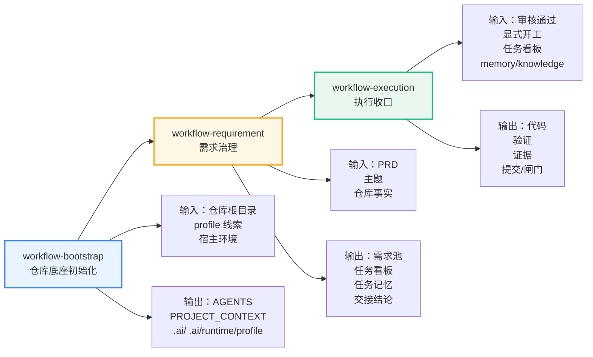
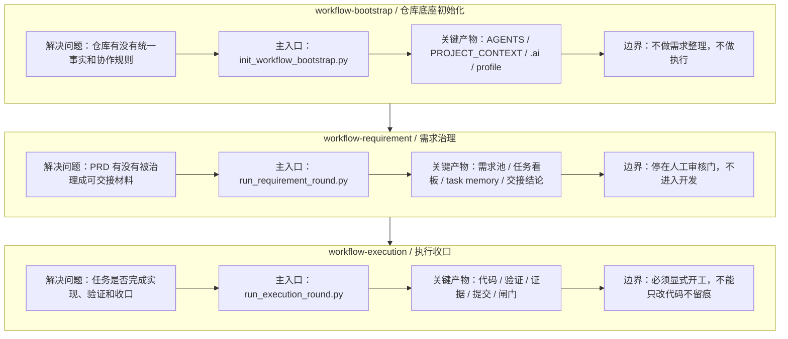
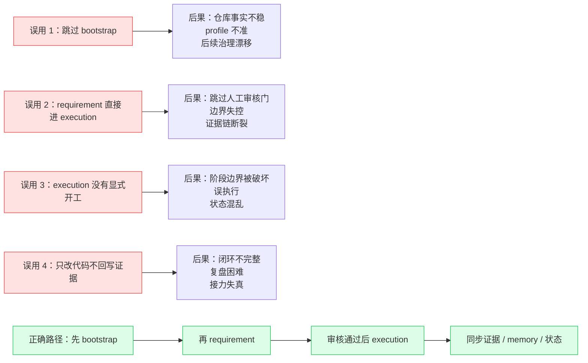

# workflow 三 Skill 可视化草图

## 使用说明

这份文档用于把前面的分析材料转成可视化结构，便于后续做 PPT、讲稿和 NotebookLM 汇总。

---

## 1. 总流程图

### 讲解要点

- 三段式不是并列工具，而是固定顺序的闭环
- 每一步都有自己的输入、输出和停止点
- `workflow-requirement` 和 `workflow-execution` 之间有人工审核门

---

## 2. 三 Skill 对照图

### 讲解要点

- 三个 skill 分别解决“底座问题”“需求问题”“执行问题”
- 不要把它们理解成同一层的脚本
- 每个 skill 的输出，正好是下一个 skill 的输入基础

---

## 3. 误用对照图

### 讲解要点

- 误用的本质不是命令错，而是阶段边界错
- 最容易被忽略的是审核门和证据链
- 正确路径的重点不是“做更多”，而是“按顺序做对”

